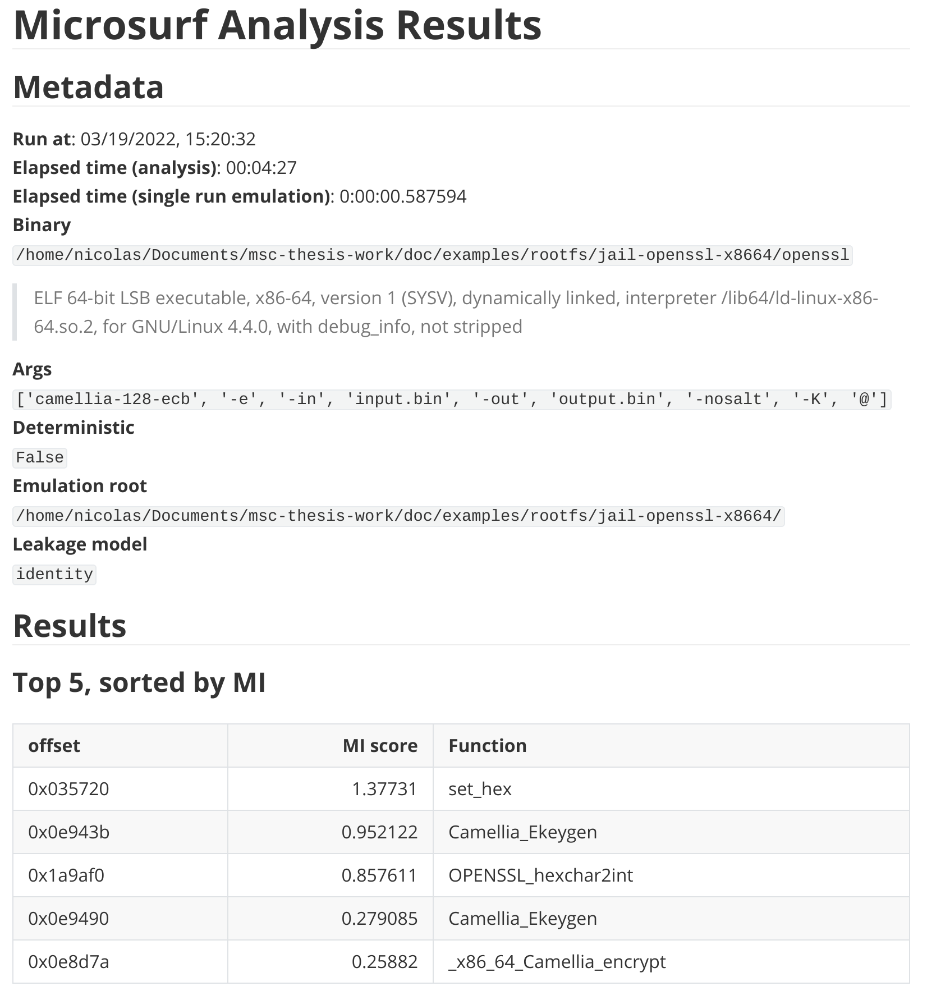

# Quickstart

```{note}
Make sure you [installed](installation.md) the framework if you wish to follow along.
```

In the general case, testing a target binary for side channels requires a number of items which are highly dependent on the binary, these include:

- The arguments to be passed to the binary
- Which input is considered to be secret
- How to generate secret inputs

As a user of the `microsurf` library, you have to specify these items. Fortunately, doing so is straightforward. The `SCDetector` is used to specify these items:

```{eval-rst}
.. autoclass:: microsurf.SCDetector
  :members:
  :undoc-members:
```

## Example: OpenSSL Camellia-128

Let us consider a practical example: Imagine that we want to test for side channels in openssl's Camellia-128 encryption algorithm on `x86-32`. Furthermore, let us assume that the binary is dynamically compiled. 

What follows is a closer explanation of the non-trivial arguments that are needed by the `SCDetector` class.

A full working example can be found [here](examples/openssl-camellia-128.py).

### Emulation root directory (`jail` argument)

For dynamic binaries you will have to provide a root directory (the `jail` argument), in which the binary will be emulated. The structure of the directory might look as follows:

```
jail-openssl-x8632/
  lib/
    ld-linux.so.2
    libc.so.6
    libcrypto.so.1.1
    libssl.so.1.1
  input.bin
  openssl
```

```{note}
As a user of the framework, you have to ensure that all required shared objects are present in the correct location. Also create make sure that any input files your binary expects are present. For dynamic x86 binaries you can check which shared objects are expected to be where by running `ldd mybinary.bin`.
```


```python
jailroot = '/path/jail-openssl-x8632/'
scd = SCDetector(
        ...
        jail=jailroot,
        ...
    )
```

### Specifying arguments (`args` argument)

If we want to encrypt a file `input.bin` using Camellia-128, we would run

```bash
openssl camellia-128-ecb -e -in input.bin -out output.bin -nosalt -K hexdata
```

where `hexdata` would be a 128bit hexadecimal key (for example: `96d496ea1378bf4f6e1f377606013e25`).

In the command above, the data we pass to the `-K` argument is secret. We can signal this to the microsurf framework by replacing the key with an '@' character:

```python
opensslArgs = [
        "camellia-128-ecb",
        "-e",
        "-in",
        "input.bin",
        "-out",
        "output.bin",
        "-nosalt",
        "-K",
        "@",
    ]
scd = SCDetector(
        ...
        args=opensslArgs
        ...
    )
```

The '@' will be replaced with the data produced by the `randGen` function. If `isFile` is true, then the framework will assume that the target binary loads the secret from a file. In that case it will replace the '@' with the path to a temporary file, whose content is generated by the `randGen` function.

### Producing secrets (`randGen` argument)

A secret often has to adhere to some specific format in order to be processed by the target binary. Since microsurf cannot guess that, it is the end user's job to specify such a function. In our example, the `-K` flag expects a 128bit key specified as a hex string. Since this is a fairly common requirement, it is already implemented in the `microsurf` framework. Other generators are also included :

```{eval-rst}
.. automodule:: microsurf.utils.generators
  :members:
```

The `SCDetector` class will validate that the function generates different secrets at each call.

```python
from microsurf.utils.generators import getRandomHexKeyFunction
scd = SCDetector(
        ...
        randGen=getRandomHexKeyFunction(128),
        ...
    )
```

```{note}
The `randGen` parameter takes a __callable__ object. The framework will validate whether it produces sufficiently random output when called.
```

### Secret leakage model (`leakagemodel` argument)

To estimate how *much* information is leaked, the `SCDetector` class needs a leakage model.

A leakage model is a transformation which is applied to the secret. An example model is the hamming weight of the secret key:

```{eval-rst}
.. autoclass:: microsurf.pipeline.LeakageModels.hamming
  :members:
  :undoc-members:
```

Custom leakage models can be passed to the `SCDetector` object.

### Selective tracing (`sharedObjects` argument)

To selectively trace shared objects, a list of names can be passed to the `sharedObjects` argument. Note that this only works for dynamic libraries. For example:

```python
sharedObjects = ['libssl', 'libcrypto']
```

will ignore every other shared library (`libc` etc).

```{note}
The binary specified in `binPath` will always be traced, no need to pass it to the `sharedObjects` parameter.
```

## Execution and results

Once an `SCDetector` object has been initialized with all the arguments needed, analysis can be started by calling the `.exec()` function:

The results will look be split in several columns:

```
0003018c - [MI = 0.22]   at set_hex                        openssl
0013f5cf - [MI = 0.21]   at OPENSSL_hexchar2int            libcrypto.so.1.1
00095610 - [MI = 0.12]   at _x86_Camellia_encrypt          libcrypto.so.1.1
00095ef0 - [MI = 0.13]   at Camellia_Ekeygen               libcrypto.so.1.1
000955f5 - [MI = 0.11]   at _x86_Camellia_encrypt          libcrypto.so.1.1
```

The first column is the relative offset within the shared object at which the leak was identified. The second column gives the estimated [mutual information](https://en.wikipedia.org/wiki/Mutual_information) score optained by applying the specified leakage model. The next column provides the function name (if the symbols are available). The last column gives the name of the (shared) object.

The `exec` function takes an optional argument `report`. If set to `True`, the results will be saved in markdown table format:


