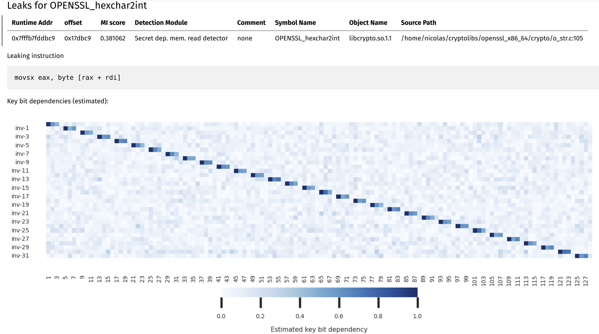

# Advanced Usage (Key-Bit Dependency Estimation)

```{note}
Make sure you [installed](installation.md) the framework if you wish to follow along.
```

In the [Quickstart](quickstart.md) section, we went over how to use the microsurf library in an end-to-end manner.

1. Create a `SCDetector` object.
2. Call the `.exec()` function on the created object.

The resulting reports will include a list of leaks detected by the framework. For example, when running the Camellia example, one of the leaks will pertain to the hexadecimal key parsing in OpenSSL:

| Runtime Addr   | offset   | Detection Module                 | Comment   | Symbol Name         | Object Name      | Source Path                                                |
|:---------------|:---------|:---------------------------------|:----------|:--------------------|:-----------------|:-----------------------------------------------------------|
| 0x7fffb7fddbc9 | 0x17dbc9 | Secret dep. mem. operation (R/W) | none      | OPENSSL_hexchar2int | libcrypto.so.1.1 | /home/nicolas/cryptolibs/openssl_x86_64/crypto/o_str.c:105 |

If we were to want to estimate how much this leak affects the confidentiality of cryptographic material, we could use the key-bit estimation technique offered by microsurf. To do so, we would run the analysis for a second time, but passing the runtime address of the leak observed in the first run as an argument to the `SCDetector` class:

```
scd = SCDetector(modules=[
            # Secret dependent memory R/W detection
            DataLeakDetector(binaryLoader=binLoader),
            # Secret dependent control flow detection
            CFLeakDetector(binaryLoader=binLoader)
            ],
            addrList=[0x7fffb7fddbc9]
        )
scd.exec()
```

The result of the second run will be an in-depth analysis of the specified address. Microsurf will produce a heatmap which visualizes the estimated key-bit dependencies:




