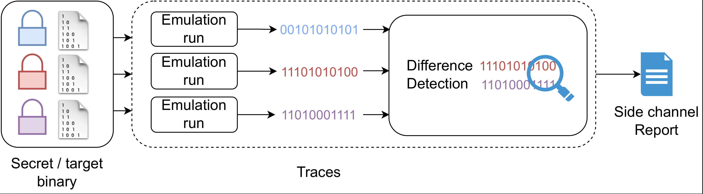

# Quickstart

_This page will walk you through the basics of using Microsurf with an applied example, testing for side
channel vulnerabilities in OpenSSL's Camellia-128 implementation._

```{note}
Make sure you [installed](installation.md) the framework if you wish to follow along.
```

## Introduction

Microsurf is a framework for finding side-channels in compiled binaries. Similarly to other tools, it enables the detection of:

- Secret-dependent memory accesses.
- Secret-dependent control flow operations.

These are of importance when developing constant-time (or data-oblivious) code, since they are the source of leakages such as secret-dependent execution timing. Some flaws caused by such leakages may be exploited remotely.

The advantage of Microsurf is that it supports a wide set of target architectures (`x86, x86-64, arm, mips, powerPC, riscv`) without requiring manual secret annotations.

### How it works

Microsurf works by emulating a target binary with different secrets:



During emulation, we gather traces which contain information on accessed memory locations and control flow. We then detect differences in traces recorded with different secrets to report secret-dependent operations.

We control possible sources of randomness during emulation to ensure that differences are indeed secret-dependent.

## Usage

In the general case, testing a target binary for side channels requires a number of items which are highly dependent on the binary, these include:

- The arguments to be passed to the binary
- Which input is considered to be secret
- How to generate secret inputs

As a user of the `microsurf` library, you have to specify these items. Fortunately, doing so is straightforward.
The general workflow is as follows:

1. Create a new `BinaryLoader` instance, this will allow you to configure general settings relating to the target binary:

```{eval-rst}
.. autoclass:: microsurf.BinaryLoader

```

Most optional arguments can be left as is, we'll dive into more details later on. Let's see how you would use the 
`BinaryLoader` class if you would like to test the OpenSSL implementation of _Camellia-128_.

```{note}
A full working example can be found under `docs/examples/openssl.py` .
```

## Emulation root directory (`rootfs` argument)

For dynamic binaries you will have to provide a root directory (the `rootfs` argument), in which the binary will be emulated. The structure of the directory might look as follows:

```
jail-openssl-x8632/
  lib/
    ld-linux.so.2
    libc.so.6
    libcrypto.so.1.1
    libssl.so.1.1
  input.bin
  openssl
```

```{note}
As a user of the framework, you have to ensure that all required shared objects are present in the correct location. Also make sure that any input files your binary expects are present. For dynamic x86 binaries you can check which shared objects are expected to be where by running `ldd mybinary.bin`.
```

```{hint}
If a particular shared library is not found in the emulation root, microsurf will issue a warning with the name
of the concerned library.
```

If you have access to the source code, you can simply compile your binary using a pre-defined [toolchain](https://toolchains.bootlin.com/) and use the included `sysroot` directory as an emulation root directory. Don't forget to move your target libraries to the corresponding directory.

```{hint}
For evaluation purposes, we provide a valid emulation root directory for OpenSSl under `x86-64` (`docs/rootfs/jail-openssl-1.1.1dev-x8664`). 
```


## Specifying arguments (`args` argument)

If we want to encrypt a file `input.bin` using Camellia-128, we would run

```bash
openssl camellia-128-ecb -e -in input.bin -out output.bin -nosalt -K hexdata
```

where `hexdata` would be a 128bit hexadecimal key (for example: `96d496ea1378bf4f6e1f377606013e25`).

In the command above, the data we pass to the `-K` argument is secret. We can signal this to the microsurf framework by replacing the key with an '@' character:

```python
opensslArgs = [
        "camellia-128-ecb",
        "-e",
        "-in",
        "input.bin",
        "-out",
        "output.bin",
        "-nosalt",
        "-K",
        "@",
    ]
scd = SCDetector(
        ...
        args=opensslArgs
        ...
    )
```

The '@' will be replaced with the data produced by the `randGen` function. If `isFile` is true, then the framework will assume that the target binary loads the secret from a file. In that case it will replace the '@' with the path to a temporary file, whose content is generated by the `randGen` function.

You can also mark partial arguments as secret dependent, for example in the [mbedTLS aes driver program](https://github.com/Mbed-TLS/mbedtls/blob/development/programs/aes/crypt_and_hash.c), the expected arguments are:

```bash
./crypt_and_hash 0 input.bin output.bin AES-128-ECB SHA512 hex:5e1defa4a22621eca5ab3ec051feb3a8
```

In that case, the argument list to pass to microsurf could be:

```python
args = [
        "0",
        "input.bin",
        "output.bin",
        "AES-128-ECB",
        "SHA512",
        "hex:@",
    ]
```

## Producing secrets (`rndGen` argument)

A secret often has to adhere to some specific format in order to be processed by the target binary. Since microsurf cannot guess that, it is the end user's job to specify such a function. In our example, the `-K` flag expects a 128bit key specified as a hex string. Since this is a fairly common requirement, it is already implemented in the `microsurf` framework:

```{eval-rst}
.. autoclass:: microsurf.utils.generators.hex_key_generator
```

```{note}
The `randGen` parameter takes a __callable__ object. The framework will validate whether it produces sufficiently random output when called.
```

A list of secret generators is given [here](generators.md), along with a guide on how to write your own generators. Common use-cases such as RSA and ECDSA on-disk key generators are already included.

## Selective tracing (`sharedObjects` argument)

To selectively trace shared objects, a list of names can be passed to the `sharedObjects` argument. Note that this only works for dynamic libraries. For example:

```python
sharedObjects = ['libssl', 'libcrypto']
```

will ignore every other shared library (`libc` etc). Only canonical library names are needed, no need to pass the exact file name.

```{note}
The binary specified in `binPath` will not be traced, unless the name is passed to the `sharedObjects` parameter.
```

For OpenSSL, the BinaryLoader object would look as follows:

```python
from microsurf.pipeline.Stages import BinaryLoader
from microsurf.utils.generators import hex_key_generator

rootfs = 'path-to-rootfs'
binpath = rootfs + "openssl"

opensslArgs = [
    "camellia-128-ecb",
    "-e",
    "-in",
    "input.bin",
    "-out",
    "output.bin",
    "-nosalt",
    "-K",
    "@",

]
sharedObjects = ['libcrypto'] # only trace libcrypto.so

binLoader = BinaryLoader(
    path=binpath, 
    args=opensslArgs, 
    rootfs=rootfs, 
    rndGen=hex_key_generator(keylen=128, nbTraces=8),
    sharedObjects=sharedObjects
)

```

```{hint}
The `nbTraces` argument specifies how many traces should be gathered. Increasing the number of traces increases the probability of finding new leaks.
```

## Validating `BinaryLoader` Arguments

To test whether emulation is properly supported on the target binary, we can call the following function:

```
binaryLoader.configure()
```

The return value will be non-zero in case emulation failed. For a list of common errors, please consult the [FAQ](faq.md).


## Specifying Detection Modules


There are currently two detection modules which can be used:

1. The secret dependent memory read detection [module](memory.md)
2. The secret dependent control flow detection [module](control-flow.md)

They both take a number of arguments - through most can be left to default values. For further information consult the pages
dedicated to the two modules.

The only required argument is the `binaryLoader`, which is used to pass the previously created `BinaryLoader` object:

```python
from microsurf.pipeline.DetectionModules import CFLeakDetector, DataLeakDetector

binLoader = BinaryLoader(...)
data_leak_detection = DataLeakDetector(binaryLoader=binLoader)
cf_leak_detection = CFLeakDetector(binaryLoader=binLoader)
```

## Executing the analysis

Having created our required detection modules, we are now ready to execute the side channel detection pipeline.
To do so, we can create a `SCDetector` object and pass along the list of detection modules:

```python
from microsurf.pipeline.DetectionModules import CFLeakDetector, DataLeakDetector
from microsurf.pipeline.Stages import BinaryLoader
from microsurf import SCDetector

# Create the binary loader as described before
binLoader = BinaryLoader(...)
data_leak_detection = DataLeakDetector(binaryLoader=binLoader)
cf_leak_detection = CFLeakDetector(binaryLoader=binLoader)

scd = SCDetector(modules=[
        data_leak_detection,
        cf_leak_detection,
    ])

scd.exec()
```

This will search for any data and control flow side channels in the target application.

```{note}
Per default, the `SCDetector` will execute a quick analysis. Key bit dependency estimation is not performed by default. Refer to [advanced](advanced.md) usage to learn how to estimate key-bit dependencies.
```

By default a report will be created in the `reports` directory. If not present, it will be created. If you wish to continue
working and processing results with python, you can access the underlying pandas dataframe like so:

```python
result_dataframe = scd.DF
```

A detailed documentation for all high level modules can be found [here](modules.md).