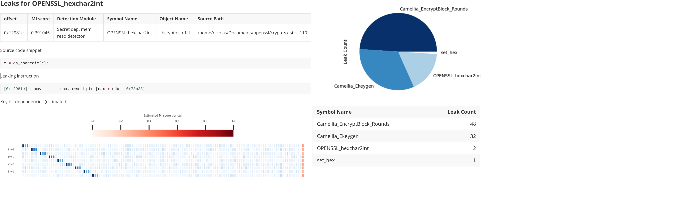

<p align="center">
    
</p>

<p align="center">
  <a href="#About">About</a> •
  <a href="#Features">Features</a> •
  <a href="#Examples">Examples</a> •
  <a href="#Documentation">Documentation</a> •
  <a href="#Installation">Installation</a> •
  <a href="#Contributing">Contributing</a> •
  <a href="#License">License</a>
</p>


------

### About

***Microsurf*** is a framework for finding side channel vulnerabilities in compiled binaries. It features:


- **Cross-architecture** support (tested on `i386`, `x86_64`, `arm32`, `arm64`, `riscv`, `mips`)
- **No source code required** - black-box testing and analysis
- Leverages **machine learning** to learn optimal leakage model
- Estimates **dependency of every secret bit** on the leakage
- Provides a **convenient visualization** of said dependencies
- Human-readable **markdown reports**, parsable **json reports** or directly as pandas **dataframes**
- Forced deterministic execution by hooking sources of randomness (**less false positives**)
- **Easy to use**. Provides a high level API for developers and users alike
- **Fast.** Optimized for parallel execution





### Features


|                                        | Microsurf | [DATA](https://github.com/Fraunhofer-AISEC/DATA) | [Microwalk](https://github.com/UzL-ITS/Microwalk) | [Timecop](https://www.post-apocalyptic-crypto.org/timecop/) | [ct-grind](https://github.com/agl/ctgrind) |
| -------------------------------------- | :-------: | :----------------------------------------------: | :-----------------------------------------------: | :---------------------------------------------------------: | :----------------------------------------: |
| Memory side channel detection          |     ✔️     |                        ✔️                         |                         ✔️                         |                              ✔️                              |                     ✔️                      |
| Control Flow side channel detection    |     ✔️     |                        ✔️                         |                         ✔️                         |                              ✔️                              |                     ✔️                      |
| Support for custom leakage models      |     ✔️     |                        ✔️                         |                         ❌                         |                              ❌                              |                     ❌                      |
| Works without source or recompilation  |     ✔️     |                        ✔️                         |                         ✔️                         |                              ❌                              |                     ❌                      |
| Forced deterministic execution         |     ✔️     |                        ✔️                         |                         ✔️                         |                              ❌                              |                     ❌                      |
| Ability to learn optimal leakage model |     ✔️     |                        ❌                         |                         ❌                         |                              ❌                              |                     ❌                      |
| Cross-architecture support             |     ✔️     |                        ❌                         |                         ❌                         |                              ✔️                              |                     ✔️                      |
| Actively Maintained [1]                |     ✔️     |                        ✔️                         |                         ❌                         |                              ❌                              |                     ❌                      |
| High level API and easy to use         |     ✔️     |                        ❌                         |                         ❌                         |                              ✔️                              |                     ✔️                      |

[1]: Active contributions in the last 3 months

### Examples

Analyzing a binary is simple: You first begin by creating a `BinaryLoader` object, which tells where the target is and how it should be emulated:

```python
# the arguments to pass to the binary.
# the secret is marked with a '@' placeholder
opensslArgs = [
    "camellia-128-ecb",
    "-e",
    "-in",
    "input.bin",
    "-out",
    "output.bin",
    "-nosalt",
    "-K",
    "@",
]

# list of objects to trace
sharedObjects = ['libcrypto']

binLoader = BinaryLoader(
    path=binpath,
    args=opensslArgs,
    # emulation root directory
    rootfs=jailroot,
    # openssl_hex_key_generator generates hex secrets, these will replace the
    # @ symbol in the arg list during emulation.
    rndGen=openssl_hex_key_generator(128),
    sharedObjects=sharedObjects
)
```

Now all that remains is to create an `SCDetector` object and pass any required detection modules. Calling the `.exec()` function will run the analysis.

```python
scd = SCDetector(modules=[
        # Secret dependent memory read detection
        DataLeakDetector(binaryLoader=binLoader),
        # Secret dependent control flow detection
        CFLeakDetector(binaryLoader=binLoader),
    ])
# Run the analysis
scd.exec()
```

The results will be saved to disk in Markdown format. Advanced usage such key bit dependency and MI estimation are
described in the documentation.

### Documentation

Documentation can be found [here](USAGE.pdf).

### Installation

1. Create a virtualenv & activate it:

```
virtualenv env
source env/bin/activate
```

2. Install the package locally:

```
pip install -e .
```

### Contributing

Contributions are very welcome and actively encouraged. The goal is that microsurf is actively maintained and
continously improved.

### License

This is free software distributed under the [MIT License](LICENSE).
