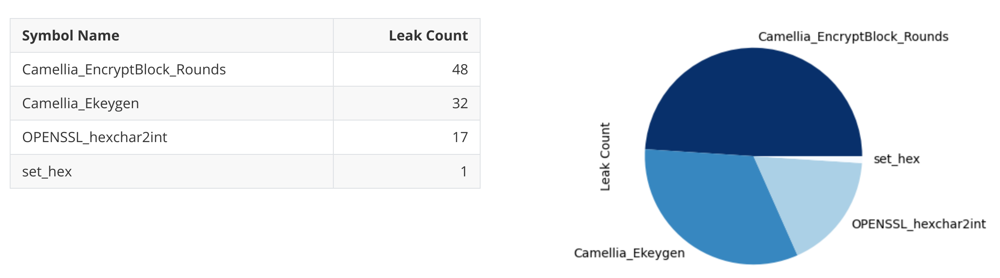
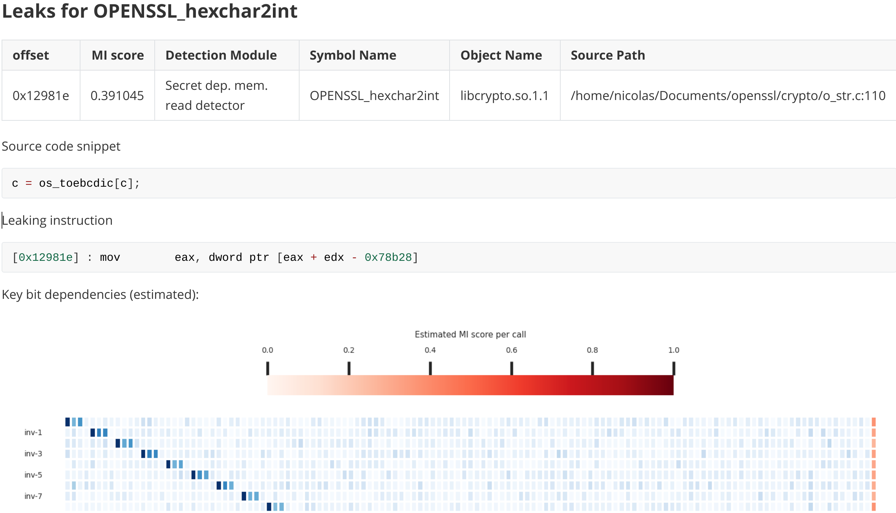

[](https://github.com/Jumpst3r/msc-thesis-work/actions/workflows/pytest.yml)


***Microsurf*** is a framework for finding side channel vulnerabilities in compiled binaries. It features:


- **Cross-architecture** support (tested on `i386`, `x86_64`, `arm32`, `arm64`, `riscv`, `mips`)
- **No source code required** - black-box testing and analysis
- Leverages **machine learning** to learn optimal leakage model
- Estimates **dependency of every secret bit** on the leakage
- Provides a **convenient visualization** of said dependencies
- Generates concise **markdown reports**, summarizing all results
- Forced deterministic execution by hooking sources of randomness (**less false positives**)
- **Easy to use**. Provides a high level API for developers and users alike
- **Fast.** Optimized for parallel execution

<p float="left">
  
   
</p>


### Usage examples 

Documentation can be found [here](USAGE.pdf)

Usage examples:

- [openssl](doc/examples/openssl.py): Analyzing common cyphers through the openssl CLI.
- [mbed TLS](doc/examples/mbed-tls-crypto.py): Analyzing symmetric primitives of mbedTLS via a sample driver program.

### Installation

1. Create a virtualenv & activate it:

```
virtualenv env
source env/bin/activate
```

2. Install the package locally:

```
pip install -e .
```
